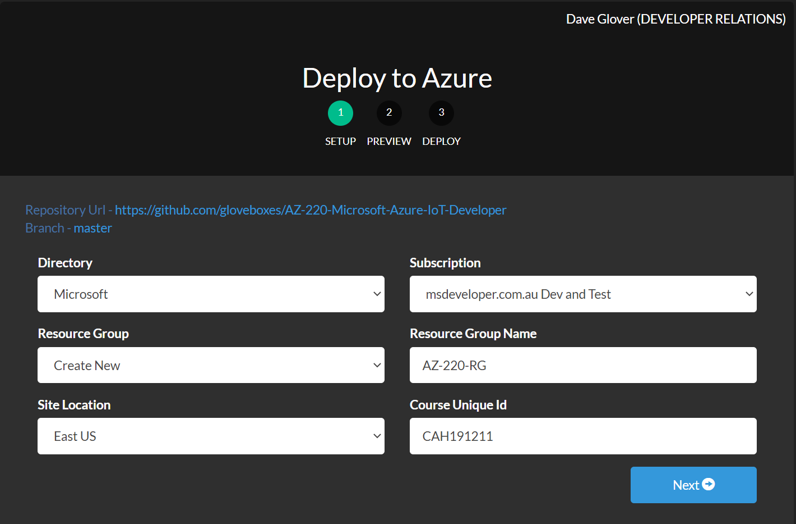

---
lab:
    title: 'Lab 13: Develop, Deploy and debug a custom module on Azure IoT Edge with VS Code'
    module: 'Module 7: Azure IoT Edge Modules'
---

# Develop, Deploy, and debug a custom module on Azure IoT Edge with VS Code

## Lab Scenario

Contoso's warehouse moves inventory that is ready to be packed for delivery on a conveyor belt.

To make sure the correct number of products have been packed, you will add a simple module to count objects detected on the belt by another object detection module (simulated) on the same IoT Edge device. We will show how to create a custom module that does object counting.

## What is a Custom Module

Azure IoT Edge enables you to deploy code to your IoT Edge devices from the cloud. The IoT Edge platform works with the cloud to deploy IoT Edge modules. IoT Edge modules are executable packages implemented as containers.

IoT Edge modules are the smallest computation units managed by IoT Edge. Using IoT Edge modules, you can analyze data on devices instead of the cloud. By moving parts of your workload to the edge, your devices can spend less time sending messages to the cloud and react more quickly to events.

---

## Prerequisites

This lab includes the following prerequisites for the development machine (lab host environment - VM or PC):

* The [.NET Core 2.1 SDK](https://dotnet.microsoft.com/download/dotnet-core/2.1)
*  [Python](https://www.python.org/) 2.7, 3.6, or 3.7
* [Visual Studio Code](https://code.visualstudio.com/) with the following extensions installed:
  * [Azure IoT Tools](https://marketplace.visualstudio.com/items?itemName=vsciot-vscode.azure-iot-tools) by Microsoft
  * [C#](https://marketplace.visualstudio.com/items?itemName=ms-vscode.csharp) by Microsoft
  * [Docker](https://marketplace.visualstudio.com/items?itemName=ms-azuretools.vscode-docker)
* Install Docker Community Edition on your computer. The Docker Client must be version 18.03.0 or later
  * [Download Docker Desktop for Mac and Windows](https://www.docker.com/products/docker-desktop)

    > **Important**: Because of the removal of Azure Container Registry support for TLS before TLS version 1.2 on January 13, 2020, you must be on Docker Client 18.03.0 or later.

## This Lab

IoT Edge solution development in VS Code

* Verify Lab Prerequisites
* Create Container Registry
* Create and customize an Edge module
* Deploy modules to Edge device

## Lab Instructions

---

<!-- ### Exercise 1: Verify Lab Prerequisites

This lab assumes that the following Azure resources are available:

| Resource Type | Resource Name |
| :-- | :-- |
| Resource Group | AZ-220-RG |
| IoT Hub | AZ-220-HUB-_{YOUR-ID}_ |

If these resources are not available, you will need to complete the following steps. Click the **Deploy to Azure** button.

[](https://azuredeploy.net/?repository=https://github.com/gloveboxes/AZ-220-Microsoft-Azure-IoT-Developer/blob/master/Allfiles/Labs/13-Develop%2C%20Deploy%20and%20debug%20a%20custom%20module%20on%20Azure%20IoT%20Edge%20with%20VS%20Code/Setup)

1. The **Deploy to Azure** template will be displayed
    
2. If you have already created a **Resource Group** for this course then select it from the **Resource Group** dropdown. Otherwise, enter the **Resource Group Name** AZ-220-RG.
3. Select your preferred **Location**.
4. Enter the **Course Unique Id** you created at the beginning of this course.
5. Click **Next**, followed by **Deploy**. -->

<!-- 4. From the **Cloud Shell Bash** prompt, type the following, replacing {YOUR-ID} with the Unique ID you created at the start of this course. For example, YOUR_ID=CAH191211.

    ```bash
    YOUR_ID={YOUR-ID}
    ```

5. List locations. From the **Cloud Shell Bash** prompt, copy and paste, and run

    ```bash
    az account list-locations -o Table
    ```

6. Set your preferred location. From the **Cloud Shell Bash** prompt, run the following command, replacing {YOUR-LOCATION} with the short name of your preferred location.

    Short-names are listed in the **Name** column from the _list-location_ command you just ran. For example LOCATION=australiaeast.

    ```bash
    LOCATION={YOUR-LOCATION}
    ```

7. Create an Azure Resource Group. From the **Cloud Shell Bash** prompt, copy and paste the following command.

    ```bash
    az group create --name AZ-220-RG --location $LOCATION
    ```

8. Create an Azure IoT Hub. From the **Cloud Shell Bash** prompt, copy and paste the following command.

    ```bash
    az iot hub create --name "AZ-220-HUB-$YOUR_ID" -g AZ-220-RG --sku S1 --location $LOCATION
    ```

9. Create an Azure Container Registry. From the **Cloud Shell Bash** prompt, paste and run the following command.

    ```bash
    az acr create --name "AZ-220-ACR-$YOUR_ID" --location $LOCATION --resource-group AZ-220-RG
    ``` -->

## Exercise 1: Set up required Azure Services

In this exercise we will be setting up the following resources:

1. **Resource Group**, which is a way of keeping related resources together to make it easier to manage.
2. **Azure IoT Hub**, which is a managed service that acts as a central message hub for bi-directional communication between your IoT application and the devices it manages.
3. **Azure Container Registry**, which is a service to build, store, secure, scan, replicate and manage container images.

Follow these steps:

> **Note**:  The **lab13-setup.azcli** script is written to run in a **bash** shell environment - the easiest way to execute this is in the Azure Cloud Shell.

1. Using a browser, open the [Azure Cloud Shell](https://shell.azure.com/) and login with the Azure subscription you are using for this course.

1. If you are prompted about setting up storage for Cloud Shell, accept the defaults.

1. Verify that the Azure Shell is using **Bash**.

    The dropdown in the top-left corner of the Azure Cloud Shell page is used to select the environment. Verify that the selected dropdown value is **Bash**.

1. On the Azure Shell toolbar, click **Upload/Download files** (fourth button from the right).

1. In the dropdown, click **Upload**.

1. In the file selection dialog, navigate to the folder location of the GitHub lab files that you downloaded when you configured your development environment.

    In Lab 3 of this course, "Setup the Development Environment", you cloned the GitHub repository containing lab resources by downloading a ZIP file and extracting the contents locally. The extracted folder structure includes the following folder path:

    * Allfiles
      * Labs
          * 13-Develop, Deploy and debug a custom module on Azure IoT Edge with VS Code
            * Setup

    The lab13-setup.azcli script file is located in the Setup folder for lab 13.

1. Select the **lab13-setup.azcli** file, and then click **Open**.

    A notification will appear when the file upload has completed.

1. To verify that the correct file has uploaded, enter the following command:

    ```bash
    ls
    ```

    The `ls` command lists the content of the current directory. You should see the lab13-setup.azcli file listed.

1. To create a directory for this lab that contains the setup script and then move into that directory, enter the following Bash commands:

    ```bash
    mkdir lab13
    mv lab13-setup.azcli lab13
    cd lab13
    ```

    These commands will create a directory for this lab, move the **lab13-setup.azcli** file into that directory and then change directory to make the new directory the current working directory.

1. To ensure the **lab13-setup.azcli** has the execute permission, enter the following command:

    ```bash
    chmod +x lab13-setup.azcli
    ```

1. On the Cloud Shell toolbar, to edit the **lab13-setup.azcli** file, click **Open Editor** (second button from the right - **{ }**).

1. In the **Files** list, to expand the lab4 folder, click **lab13**, and then click **lab13-setup.azcli**.

    The editor will now show the contents of the **lab13-setup.azcli** file.

1. In the editor, update the values of the `{YOUR-ID}` and `{YOUR-LOCATION}` variables.

    In the sample below, you need to set `{YOUR-ID}` to the Unique ID you created at the start of this course - i.e. **CAH191211**, and set `{YOUR-LOCATION}` to the location that matches your resource group.

    ```bash
    #!/bin/bash

    RGName="AZ-220-RG"
    IoTHubName="AZ-220-HUB-{YOUR-ID}"

    Location="{YOUR-LOCATION}"
    ```

    > **Note**:  The `{YOUR-LOCATION}` variable should be set to the short name for the region where you are deploying all of your resources. You can see a list of the available locations and their short-names (the **Name** column) by entering this command:
    >
    > ```bash
    > az account list-locations -o Table
    >
    > DisplayName           Latitude    Longitude    Name
    > --------------------  ----------  -----------  ------------------
    > East Asia             22.267      114.188      eastasia
    > Southeast Asia        1.283       103.833      southeastasia
    > Central US            41.5908     -93.6208     centralus
    > East US               37.3719     -79.8164     eastus
    > East US 2             36.6681     -78.3889     eastus2
    > ```

1. In the top-right of the editor window, to save the changes made to the file and close the editor, click **...**, and then click **Close Editor**.

    If prompted to save, click **Save** and the editor will close.

    > **Note**:  You can use **CTRL+S** to save at any time and **CTRL+Q** to close the editor.

1. To create the resources required for this lab, enter the following command:

    ```bash
    ./lab13-setup.azcli
    ```

    This will take a few minutes to run. You will see JSON output as each step completes.

Once the script has completed, you will be ready to continue with the lab.

---

### Exercise 2: Install Azure IoT EdgeHub Dev Tool

The Azure IoT EdgeHub Dev Tool provides a local development experience with a simulator for creating, developing, testing, running, and debugging Azure IoT Edge modules and solutions.

The Azure IoT EdgeHub Dev Tool reduces the developer environment set-up complexity and streamlines the development process by reducing the time taken to build, deploy, and debug your Azure IoT Edge modules.

In this exercise, you will install the Azure IoT EdgeHub Dev Tool.

1. To develop Azure IoT Edge modules with C#, you will need to install the Azure IoT EdgeHub Dev Tool. This tool required Python 2.7, 3.6, or 3.7 to be installed.

    > **Note**:  Currently, the Azure IoT EdgeHub Dev Tool uses a docker-py library that is not compatible with Python 3.8.

1. To install Python, navigate to [https://www.python.org/downloads/](https://www.python.org/downloads/), then download and install Python.

1. Pip is required to install the Azure IoT EdgeHub Dev Tool on your development machine. With Python already installed, run the following commands to install Pip:

    ```cmd/sh
    curl https://bootstrap.pypa.io/get-pip.py -o get-pip.py
    python get-pip.py
    ```

    > **Important**: When downloading code like this, you should consider reviewing the code before running it.

    If you have issues installing Pip, please reference the official Pip [installation instructions](https://pip.pypa.io/en/stable/installing/).

    > **Note**: On Windows, Python and/or Pip are sometimes installed but are not in the `PATH`.  Check with your instructor if you have Python installed but it does not seem to be available.

1. Run the following command to install [Azure IoT EdgeHub Dev Tool](https://pypi.org/project/iotedgehubdev/)

    ```cmd/sh
    pip install iotedgehubdev
    ```

    > **Note**:  If you have multiple Python including pre-installed Python 2.7 (for example, on Ubuntu or macOS), make sure you are using the correct `pip` or `pip3` to install `iotedgehubdev`.

Now we have configured the python environment and installed these tools, we are now ready to create an Azure Container Registry which will be used to store our custom IoT Edge Module.

---

### Exercise 3: Log into Azure Container Registry

In this exercise, you will log the Docker client into Azure Container Registry so that you can build, push, and store container images in Azure. Later you will learn how to deploy container images stored in the Azure Container Registry to Azure IoT Edge devices.

1. If necessary, log in to your Azure portal using your Azure account credentials.

    If you have more than one Azure account, be sure that you are logged in with the account that is tied to the subscription that you will be using for this course.

1. Navigate to the **AZ220ACR{YOUR-ID}** resource.

1. In get the admin username and password, on the left-hand side, under **Settings**, click **Access keys**, then **Enable** Admin user.

    Make a note of the following values:

    * **Login server**
    * **Username** - this is the admin username and will match the ACR name - **AZ220ACR{YOUR-ID}**
    * **password** - this is the admin password

1. Ensure Docker is started and running on your computer.

1. Once you have your authentication information, you can authenticate to the new registry for future Docker operations.  Open a local shell on your machine and run the following command:

    ```cmd/sh
    docker login --username <username> <loginserver>
    ```

    Replace the three placeholders with the information you recorded, and enter the password you recorded when prompted.  For example:

    ```cmd/sh
    docker login --username az220acrcah191204 az220acrcah191204.azurecr.io
    ```

    This command will record your credentials in the local Docker client configuration file (`$HOME/.docker/config.json`) or your operating system's secure credential storage mechanism (depending on the Docker configuration) for future use by the Docker toolset.

Now that we have created the Azure Container Registry and authenticated our local machine against it, we can create a custom IoT Edge Module container that will be store in the registry.

---

### Exercise 4: Create a Custom Edge Module in C\#

In this exercise, you will create an Azure IoT Edge Solution that contains a custom Azure IoT Edge Module written in C#.

1. Open Visual Studio Code.

1. To open the **Command Palette**, click on the **View** menu, then click on **Command Palette**.

1. In the Command Palette, enter and run the command `Azure IoT Edge: New IoT Edge Solution`.

1. Browse to the folder where you want to create the new solutions, then click **Select folder**.

1. when prompted for a solution name, enter `EdgeSolution`. This will be the directory name for the new **IoT Edge Solution** that will be created.

1. When prompted for the module template language, select the **C# Solution** module template. This will define `C#` as the development language for the custom IoT Edge Module added to the solution.

1. When prompted for the name of the custom IoT Edge Module, enter `ObjectCountingModule`. This will be the name of the new IoT Edge Module that is being created.

1. Provide the name of the Docker image repository for the module. This will be the Docker repository where the IoT Edge Module docker image will be published. Replace the `localhost:5000` part of the default `localhost:5000/objectcountingmodule` repository location with the name of the Azure Container Registry server - similar to `az220acr{your-id}.azurecr.io`

    The Docker image repository location will be in the following format:

    ```text
    <acr-name>.azurecr.io/<module-name>
    ```

    Be sure to replace the placeholders with the appropriate values:

    * `<acr-name>`: Replace with the name of the Azure Container Registry service.
    * `<module-name>`: Replace with the name of the custom Azure IoT Edge Module that's being created.

    > **Note**:  The default Docker image repository in Visual Studio Code is set to `localhost:5000/<your module name>`. If you were to use a local Docker registry for testing, then **localhost** is fine.

    > **Important**: Make sure to remove any reference to port `5000` from your ACR references!  That port is used for a local Docker repository but it not used in the ACR case.

1. Once the new **IoT Edge Solution** has been created, Visual Studio Code will open the solution. In the **Explorer** pane, notice the files and directories that were created as part of the new IoT Edge Solution.

1. Answer **Yes** if Visual Studio Code prompts with **Required assets to build and debug are missing, Add them?**.

---

### Exercise 5: Set the Azure Container Registry Credentials

As of when this lab was written, the Visual Studio Code Azure IoT Edge developer tools do not automatically perform the `docker login` when pushing container images to Azure Container Registry. The Azure Container Registry credentials need to be added to an **.env** environment variables file.

1. Open the `.env` file within the root directory of the IoT Edge Solution. This file is where the username and password are configured for accessing your Docker registry.

    The username and password are stored in this file using the following format:

    ```text
    CONTAINER_REGISTRY_USERNAME_<registry-name>=<registry-username>
    CONTAINER_REGISTRY_PASSWORD_<registry-name>=<registry-password>
    ```

    The placeholders in the above values are defined as follows:

    * `<registry-name>`: The name of your Docker registry.
    * `<registry-username>`: The username to use for accessing your Docker registry.
    * `<registry-password>`: The password to use for accessing your Docker registry.

    Within the `.env` file, notice that the `<registry-name>` has already been added to the configuration values within the file. The value added will match the name of the Docker registry specified when creating the IoT Edge Solution.

1. Within the `.env` file, replace the `<registry-username>` placeholder with the **Registry name** (_aka Username_) of the Azure Container Registry that was previously created, and replace the `<registry-password>` placeholder with the **password** for the Azure Container Registry.

    > **Note**:  The Azure Container Registry **Username** and **password** values can be found by accessing the **Access keys** pane for the **Azure Container Registry** service within the Azure portal if you did not record them earlier.

---

### Exercise 6: How Azure IoT Edge deployments work

You will be using the Azure IoT Edge Simulator for development purposes in this lab. But for deployments to test and production devices then the Azure IoT Edge Runtime must be installed.

#### Azure IoT Edge Runtime

 The IoT Edge runtime must be installed on an Azure IoT Edge device before you can deploy a solution to the device. The runtime is responsible for:

1. Downloading and starting container images on the IoT Edge device
2. Version management. It ensures that when a new module version is available it will be downloaded, the existing module stopped, and the new version started in its place.
3. Routing messages between modules running on the IoT Edge device and to Azure IoT.
4. It manages and monitors the health of solutions running on the device, including restarting crashed applications.
5. Reports the health and state of the solution to Azure IoT for centralized management.

    

#### The Deployment Manifest

Open the `deployment.template.json` file within the root IoT Edge Solution directory. This file is the _deployment manifest_ for the IoT Edge Solution. 

The deployment manifest tells an IoT Edge device (or a group of devices) which modules to install and how to configure them. The deployment manifest includes the _desired properties_ for each module twin. IoT edge devices report back the _reported properties_ for each module.

#### IoT Edge Runtime System Modules

In the deployment.template.json file, you will see references to two required modules named `$edgeAgent`, and `$edgeHub`. These two modules are part if the IoT Edge Runtime.

#### IoT Edge Hub

It acts as a local proxy for IoT Hub by exposing the same protocol endpoints as IoT Hub. This consistency means that clients (whether devices or modules) can connect to the IoT Edge runtime just as they would to IoT Hub.

#### IoT Edge Agent

It is responsible for instantiating modules, ensuring that they continue to run, and reporting the status of the modules back to IoT Hub.

#### System Modules

Scroll through the `deployment.template.json` deployment manifest file, and notice the following sections within the `properties.desired` section of the `$edgeAgent` element:

* `systemModules` - This defines Docker images to use for the `$edgeAgent` and `$edgeHub` system modules.

* `modules` - This defines the various modules that will be deployed and run on the IoT Edge device (or a group of devices).

#### Application Modules

Notice that within the `modules` section for the `$edgeAgent`, there are two modules defined:

* `ObjectCountingModule`: This is the custom IoT Edge Module that is being created as part of this new IoT Edge Solution.

* `SimulatedTemperatureSensor`: This defines the Simulated Temperature Sensor module to be deployed to the IoT Edge device.

#### Routes

The IoT Edge hub manages communication between modules, IoT Hub, and any leaf devices. Routes declare how messages are passed within a deployment. You can have multiple routes within the same deployment.

Notice the `$edgeHub` section of the deployment manifest. This section defines the desired properties (via `properties.desired` element) that includes the message routes for communicating messages between the IoT Edge Modules and finally to Azure IoT Hub service.

```json
"$edgeHub": {
    "properties.desired": {
    "schemaVersion": "1.0",
    "routes": {
        "ObjectCountingModuleToIoTHub": "FROM /messages/modules/ObjectCountingModule/outputs/* INTO $upstream",
        "sensorToObjectCountingModule": "FROM /messages/modules/SimulatedTemperatureSensor/outputs/temperatureOutput INTO BrokeredEndpoint(\"/modules/ObjectCountingModule/inputs/input1\")"
    },
    ...
    }
}
```

* The `sensorToObjectCountingModule` route is configured to route messages from the `SimulatedTemperatureSensor` (via `/messages/modules/SimulatedTemplaratureSensor/outputs/temperatureOutput`) module to the custom `OutputCounterModule` module (via `BrokeredEndpoint(\"/modules/ObjectCountingModule/inputs/input1\")"`).

* The `ObjectCountingModuleToIoTHub` route is configured to route messages that are sent out from the custom `OutputCounterModule` module (via `/messages/modules/SimulatedTemperatureSensor/outputs/temperatureOutput`) to the Azure IoT Hub service (via `$upstream`).

---

### Exercise 7: Understanding the Custom Module Template

In Exercise 4, you created an Azure IoT Edge module named _objectCountingModule_. This skeleton project can use as a starting point for your development project.

Unmodified, the role of this module is to maintain a running count of messages routed to it, each message is then enriched with the current count, then depending on routing rules either routed to the next module or upstream to Azure IoT Hub.

Often modules in an Azure IoT Edge solution will act as a pipeline. Messages are _routed_ from one module to another, and then finally _$upstream_ to Azure IoT.

In this exercise, you will learn about the structure and the function of the _objectCountingModule_ module.


1. Expand the `/modules/ObjectCountingModule` directory within the solution. Notice this directory contains the source code files for the new IoT Edge Module being developed.

1. Open the `/modules/ObjectCountingModule/Program.cs` file. This file contains the template source code for the newly created custom IoT Edge Module. This code provides a starting point for creating custom IoT Edge Modules.

1. Locate the `static async Task Init()` method. This method initializes the `ModuleClient` for handling messages sent to the module and sets up the callback to receive messages. Read the code comments within the code for this method and notice what each section of code does.

1. Locate the `static async Task<MessageResponse> PipeMessage(` method. This method is called whenever the module is sent a message from the EdgeHub. The current state of the source code within this method receives messages sent to this module and pipes them out to the module output, without any change. Read through the code within this method and notice what it does.

1. Also, within the `PipeMessage` method, notice the following lines of code and what they do, as follows:

    The following line of code within the method increments a counter that counts the number of messages sent to the module:

    ```csharp
    int counterValue = Interlocked.Increment(ref counter);
    ```

    The following lines of code within the method write out to the Module's `Console` a message that contains the total number of messages received by the Module, along with the current message's body as JSON.

    ```csharp
    byte[] messageBytes = message.GetBytes();
    string messageString = Encoding.UTF8.GetString(messageBytes);
    Console.WriteLine($"Received message: {counterValue}, Body: [{messageString}]");
    ```

We have now created and configured a sample custom module. Next, we will debug it in the IoT Edge Simulator.

---

### Exercise 8: Create an Azure IoT Edge Device

Before we can send any messages from this solution we need to create an Azure IoT Edge device in Azure IoT Hub.

In this exercise, you will create an Azure IoT Edge device and copy the connection string that will be used to authenticate the solution with Azure IoT Hub.

1. If necessary, log in to your Azure portal using your Azure account credentials.

    If you have more than one Azure account, be sure that you are logged in with the account that is tied to the subscription that you will be using for this course.

1. On your Resource group tile, click **AZ-220-HUB-_{YOUR-ID}_** to navigate to the Azure IoT Hub.

1. In the left-hand navigation area, under **Settings**, click **Shared access policies**.

1. In the list of policies, click **iothubowner**.

    > **Important**: The Edge Simulator requires a privileged role for configuration.  You would not use such a privileged role for normal use cases.

1. In the **device** detail pane, copy the value for **Connection string--primary key**.

    Record this value, as you will need it below.

1. On the IoT Hub summary blade, under the Automatic Device Management section, click **IoT Edge**. This section of the IoT Hub blade allows you to manage the IoT Edge devices connected to the IoT Hub.

1. Click the **Add an IoT Edge device** button to begin adding a new IoT Edge Device to the IoT Hub.

1. On the **Create a device** blade, for the **Device ID** field,  enter **SimulatedDevice**. This is the device identity used for authentication and access control.

1. For the **Authentication type**, select **Symmetric key** if it is not selected.

1. Leave the **Auto-generate keys** box checked. This will have IoT Hub automatically generate the Symmetric keys for authenticating the device.

1. Leave the other settings at their defaults, and click **Save**.

---

### Exercise 9: Set up the Azure IoT Edge Simulator

In the exercise, we will start the Azure IoT Edge Simulator and authenticate it with Azure IoT Hub.

1. Change back to the IoT Edge solution in **Visual Studio Code**.

1. Within the **Explorer** pane, right-click the `deployment.debug.template.json` debugging deployment manifest file in the root directory of the IoT Edge Solution.

1. Select the **Build and Run IoT Edge Solution in Simulator** option.

1. When a prompted with a dialog in the lower right that says, **Please setup iotedgehubdev first before starting simulator**, click **Setup**.

1. When prompted for the **IoT Hub Connection String**, enter the **Connection string--primary key** you noted earlier.

1. When prompted to **Select an IoT Edge Device**, select the **SimulatedDevice**.

    > **Note**: If you get an **Unauthorized** error in the lower-right-hand corner, run the `Azure IoT Edge: Set IoT Hub Connection String` command from the Command Palette to reconfigure your simulator connection string, then `Azure IoT Edge: Setup IoT Edge Simulator` to try to select your device again.

1. Within the **TERMINAL** window inside **Visual Studio Code**, you may be prompted for your Admin password on your local machine, particularly on Linux or macOS. Enter your password at the prompt and press **Enter**.

    The reason it's asking for your password is that the setup command for `iotedgehubdev` is being run using `sudo` as it requires elevated privileges.

1. Once the **IoT Edge Simulator** is set up successfully, a `Setup IoT Edge Simulator successfully` message will be displayed in the **TERMINAL**.

---

### Exercise 10: Build and run the IoT Edge Solution in the simulator

In this exercise, you will build and run the custom IoT Edge Module solution using the IoT Edge Simulator from within Visual Studio Code.

1. In Visual Studio Code, open the **Command Palette**, then search for **Azure IoT Edge: Set Default Target Platform for Edge Solution** and select it.

1. Select the **amd64** target platform for the IoT Edge Solution. This target platform needs to be set to the hardware platform architecture of the IoT Edge Device.

    > **Note**: Since you are using the **IoT Edge on Ubuntu** Linux VM, the `amd64` option is the appropriate choice. For a Windows VM, use `windows-amd64`, and for modules that will be running on an ARM CPU architecture, use choose the `arm32v7` option.

1. Right-click the `deployment.debug.template.json` debugging deployment manifest file in the root directory of the IoT Edge solution, and select the **Build and Run IoT Edge Solution in Simulator** option again.

    > **Note**: If you are on Windows and see a message in the **TERMINAL** that reads, in part, `open //./pipe/docker_engine: The system cannot find the file specified.`, Docker is likely not started, or running correctly.  A Docker restart or even a full computer restart might be necessary.

    > **Note**: If you see a message that reads, in part, `image operating system "linux" cannot be used on this platform`, change your Docker configuration to support Linux containers.  (Ask your instructor for assistance if necessary.)

    > **Note**: A build may take some time depending on what Docker images you have on your machine already and the speed of your Internet connection.  The build includes downloading Docker images if not present and updating container instances if necessary.

1. Notice that once the **IoT Edge Simulator** is running, the **TERMINAL** window in **Visual Studio Code** will display the console output from the Modules that are running in the solution.

    ```text
    SimulatedTemperatureSensor    |         12/09/2019 15:05:08> Sending message: 4, Body: [{"machine":{"temperature":23.023276334173641,"pressure":1.2304998355387693},"ambient":{"temperature":20.56235126408858,"humidity":24},"timeCreated":"2019-12-09T15:05:08.4596891Z"}]
    ObjectCountingModule           | Received message: 4, Body: [{"machine":{"temperature":23.023276334173641,"pressure":1.2304998355387693},"ambient":{"temperature":20.56235126408858,"humidity":24},"timeCreated":"2019-12-09T15:05:08.4596891Z"}]
    ObjectCountingModule           | Received message sent
    SimulatedTemperatureSensor    |         12/09/2019 15:05:13> Sending message: 5, Body: [{"machine":{"temperature":23.925331861560853,"pressure":1.3332656551145274},"ambient":{"temperature":20.69443827876562,"humidity":24},"timeCreated":"2019-12-09T15:05:13.4856557Z"}]
    ObjectCountingModule           | Received message: 5, Body: [{"machine":{"temperature":23.925331861560853,"pressure":1.3332656551145274},"ambient":{"temperature":20.69443827876562,"humidity":24},"timeCreated":"2019-12-09T15:05:13.4856557Z"}]
    ObjectCountingModule           | Received message sent
    ```

    Notice the output from the **ObjectCountingModule** contains the text `Received message: #` where `#` is the total message count that has been received by the custom **ObjectCountingModule** IoT Edge Module that was created.

---

### Exercise 11: Monitor Device to Cloud Messages

1. With the IoT Edge Simulator still running, open the Azure portal, then open the Cloud Shell by clicking the Cloud Shell icon at to top of the Azure portal.

1. Run the following command within the Azure Cloud Shell to monitor the messages being sent to Azure IoT Hub from the `SimulatedDevice` running in the IoT Edge Simulator on your local machine:

    ```cmd/sh
    az iot hub monitor-events --hub-name "AZ-220-HUB-{YOUR-ID}"
    ```

    Be sure to replace the `AZ-220-HUB-{YOUR-ID}` value in the above command with the name of your Azure IoT Hub service.

1. With everything still running, notice the output of the previous command in the Cloud Shell will display a JSON representation of the messages being received by the Azure IoT Hub.

    The output should look similar to the following:

    ```json
    {
        "event": {
            "origin": "SimulatedDevice",
            "payload": "{\"machine\":{\"temperature\":88.003809452058647,\"pressure\":8.6333453806142764},\"ambient\":{\"temperature\":21.090260561364826,\"humidity\":24},\"timeCreated\":\"2019-12-09T15:16:32.402965Z\"}"
        }
    }
    {
        "event": {
            "origin": "SimulatedDevice",
            "payload": "{\"machine\":{\"temperature\":88.564600328362815,\"pressure\":8.6972329488008278},\"ambient\":{\"temperature\":20.942187817041848,\"humidity\":25},\"timeCreated\":\"2019-12-09T15:16:37.4355705Z\"}"
        }
    }
    ```

1. Notice that even though there are 2 IoT Edge Modules running on the IoT Edge Device, there is still only a single copy of each message getting sent to Azure IoT Hub. The IoT Edge Device has a message pipeline defined where messages from the `SimulatedTemperatureSensor` are piped to the `ObjectCountingModule` which then sends messages out piped out to the Azure IoT Hub.

1. To stop monitoring Azure IoT Hub events, press **Ctrl + C** within the Azure Cloud Shell.

---

### Exercise 12: Attach the debugger to the IoT Edge solution

Visual Studio Code along with the Azure IoT Edge extension provides powerful tools for debugging modules that are running within the context of the Azure IoT Edge Simulator.

In this exercise, you will learn how to attach the debugger and step through the module code.  

1. Navigate to the Visual Studio Code **Debug** view, by clicking on the **Debug** icon on the left-hand side of the window.

1. On the dropdown at the top of the **Debug** pane, select the **ObjectCountingModule Remote Debug (.NET Core)** option.

1. Select **Start Debugging** or press **F5**

1. When prompted to **Select the process to attach to**, select the **dotnet ObjectCountingModule.dll** process.

1. Change to the **Explorer** view, and open the `/modules/ObjectCountingModule/Program.cs` source code file within the solution.

1. Locate the `static async Task<MessageResponse> PipeMessage(` method, and set a breakpoint within this method by clicking on the line and pressing **F9**.

1. Notice that execution stops at the breakpoint that is set, and the editor highlights that specific line of code.

1. Open the Visual Studio Code **Debug** view, and notice the variables in the left panel.

1. To resume execution, click the **Continue** button, or press **F5**.

1. Notice that each time the breakpoint is hit, execution stops.

1. To stop debugging, click the **Disconnect** button, or press **Shift + F5**.

1. To stop the IoT Edge Simulator, open the **Command Palette**, then select the **Azure IoT Edge: Stop IoT Edge Simulator** option.

Now that the module has been created and tested in the IoT Edge simulator, it is time to deploy it to the cloud.

<!-- ---

### Exercise 6: Debug in Local Mode with IoT Edge Simulator

You can also deploy and debug in Local Mode with the IoT Edge Simulator. Local Mode can help to reduce of the time to build, deploy, debug cycle. For more information see [Use Visual Studio Code to develop and debug modules for Azure IoT Edge](https://docs.microsoft.com/en-us/azure/iot-edge/how-to-vs-code-develop-module). -->

---

### Exercise 13: Deploy IoT Edge Solution

In this exercise, you will build and publish the custom IoT Edge Module into the Azure Container Registry (ACR) service. Once published to ACR, the custom module will then be made available to be deployed to any IoT Edge Device.

1. From Visual Studio Code, change to the **Explorer** view, and open `.env` to ensure credentials for the Azure Container Registry have been set. Do this by opening the `.env` file located in the root directory of the IoT Edge Solution and reviewing it.  When set correctly, the `CONTAINER_REGISTRY_USERNAME_<acr-name>` key will have its value set to the Azure Container Registry service name, and the `CONTAINER_REGISTRY_PASSWORD_<acr-name>` key will have its value set to the **Password** for the Azure Container Registry service. Keep in mind, the `<acr-name>` placeholders in the keys will be set to the ACR service name (is all lowercase) automatically when the IoT Edge Solution was created.

    The resulting `.env` file contents will look similar to the following:

    ```text
    CONTAINER_REGISTRY_USERNAME_az220acrcah191204=AZ220ACRCAH191204
    CONTAINER_REGISTRY_PASSWORD_az220acrcah191204=Q8YErJFCtqSe9C7BWdHOKEXk+C6uKSuK
    ```

1. Right-click `deployment.template.json`, and select **Build and Push IoT Edge Solution**.

1. The status of the Build and Push IoT Edge Solution operation is displayed within the Visual Studio Code **TERMINAL** window. Once the process completes, the custom `ObjectCountingModule` IoT Edge Module will have been built, and then the Docker image for the IoT Edge Module will be published to the Azure Container Registry service.

---

### Exercise 14: Create an Azure IoT Edge Cloud Deployment

Now that the Azure IoT Edge modules have been pushed to the Azure Container Registry it is time to learn how to configure and deploy these modules to new Azure IoT Edge devices.

1. Open the Azure portal. If necessary, log in to your Azure portal using your Azure account credentials.

    If you have more than one Azure account, be sure that you are logged in with the account that is tied to the subscription that you will be using for this course.

1. On your Resource group tile, click **AZ220ACR{YOUR-ID}** to navigate to your Azure Container Registry (ACR) service.

1. On the left-hand side, under the **Services** section, click on the **Repositories** link.

1. On the **Repositories** pane, notice that the `objectcountingmodule` repository now exists within the ACR service. This was created when the custom `ObjectCountingModule` IoT Edge Module was published from within Visual Studio Code.

    > **Note**: If the repository is not present, review the output from the Push action and ensure that you did not leave references to the `:5000` port number with your ACR references; you can do an **Edit**, **Find in Files** to confirm this.  You should also validate your credentials in the `.env` file and validate that you performed the `docker login` step earlier in the lab.

1. Click on the **objectcountingmodule** repository to navigate to the repository details.

1. On the **Repository** details pane for the **objectcountingmodule** repository, notice in the list of tags there is a tag named `0.0.1-amd64`

1. Click on the `0.0.1-amd64` tag to open up the details pane for this Tag within the `objectcountingmodule` repository.

    Notice the properties listed, including _Tag creation date_,  _Tag last updated date_, and other properties displaying information about the Tag.

1. Copy the **Repository** name and the **Tag** for use later on.

    The Repository and Tag names will be used to pull down this specific version of the Docker image for the custom IoT Edge Module to run in an IoT Edge Device.

    The format of the Docker image Repository and Tag names combined will be in the following format:

    ```text
    <repository-name>:<tag>
    ```

    Here's an example of a full Docker image name for the `objectcountingmodule` IoT Edge Module:

    ```text
    objectcountingmodule:0.0.1-amd64
    ```

#### Create a new Azure IoT Edge device

1. Navigate to your Azure IoT Hub (`AZ-220-HUB-{YOUR-ID}`) resource. With the custom `objectcountingmodule` IoT Edge Module published to Azure Container Registry (ACR), the next step is to create a new IoT Edge Device within IoT Hub and configure it to run the new custom IoT Edge Module.

1. On the **IoT Hub** blade, under the **Automatic Device Management** section, click on the **IoT Edge** link.

1. On the IoT Hub **IoT Edge** pane, click the **Add an IoT Edge device** button at the top.

1. On the **Create a device** blade, for the **Device ID** field, enter `objectcountingdevice`.

1. Under **Authentication type**, select the **Symmetric key** option, and ensure the **Auto-generate keys** checkbox is checked.

    For this unit, we'll keep the IoT Edge Module registration simple by choosing _Symmetric key_ authentication. With the _Auto-generate keys_ option selected, the IoT Hub with automatically generate authentication keys for this device.

1. Click **Save**.

#### Set the deployment modules

1. On the **IoT Edge** pane, in the list of IoT Edge devices, click on the **objectcountingdevice** IoT Edge Device to open the details view for the device.

1. At the top of the `objectcountingdevice` IoT Edge Device details blade, click on the **Set Modules** button.

1. On the **Set modules on device: objectcountingdevice** blade, within the **Container Registry Settings** section, enter the following values:

    * **Name**: Enter the **Registry name** of the Azure Container Registry (e.g. `az220acrcah191204`)
    * **Address**: Enter the **Login server** (or DNS name) of the Azure Container Registry service (ex: `az220acrcah191204.azurecr.io`)
    * **User Name**: Enter the **Username** for the Azure Container Registry service
    * **Password**: Enter the **password** for the Azure Container Registry service

    > **Note**:  The Azure Container Registry (ACR) service _Registry name_, _Login server_, _Username_, and _Password_ can be found on the **Access keys** pane for the service.

1. On the **Set modules on device: objectcountingdevice** blade, within the **IoT Edge Modules** section, click the **Add** button and select **IoT Edge Module**.

1. On the **Add IoT Edge Module** pane, for the **IoT Edge Module Name** enter `objectcountingmodule`.

1. Under **Module Settings**, enter the full URI and tagged name of the Docker image for the custom IoT Edge Module that was copied previously, e. g

    ```text
    <container-registry-login-server>/<repository-name>:<tag>
    ```

    Be sure to replace the placeholders within the above **Image URI** format with the appropriate values:

    * `<container-registry-login-server>` * The **Login server**, or DNS name, for the Azure Container Registry service.
    * `<repository-name>` * The **Repository name** for the Custom IoT Edge Module's Docker image, that was copied previously.
    * `<tag>` * The **Tag** for the Custom IoT Edge Module's Docker image, that was copied previously.

    The resulting **Image URI** to be entered into the field will be similar to the following:

    ```text
     az220acrcah191204.azurecr.io/objectcountingmodule:0.0.1-amd64
    ```

1. Leave the rest of the settings at their defaults and click **Add**.

#### Set module routes

1. Now back on the **Set modules on device: objectcountingdevice** blade, click **Next: Routes**.

1. Within the **Specify Routes**, the editor will display the configured default route for the IoT Edge Device. At this time, it should be configured with a route that sends all messages from all modules to Azure IoT Hub:

    * Name: **route**
    * Value: `FROM /messages/* INTO $upstream`

    Delete this route by clicking the trash icon to the right of the route and then add the two following routes:

    | NAME | VALUE |
    | --- | --- |
    | `AllMessagesToObjectCountingModule` | `FROM /* INTO BrokeredEndpoint("/modules/objectcountingmodule/inputs/input1")` |
    | `ObjectCountingModuleToIoTHub` | `FROM /messages/modules/objectcountingmodule/outputs/* INTO $upstream` |

1. Notice the IoT Hub message routing query specified for the **AllMessagesToObjectCountingModule** route.

    This route specifies the **Source** value of `/*`. This applies the route to all device-to-cloud messages or twin change notifications from any module or leaf device.

    This route specifies the **Destination** value of `BrokeredEndpoint("/modules/objectcountingmodule/inputs/input1")`. This sends all messages from the Source of this route to the `objectcountingmodule` IoT Edge Module's input.

1. Notice the IoT Hub message routing query specified for the  **ObjectCountingModuleToIoTHub** route.

    This route specifies the **Source** value of `/messages/modules/objectcountingmodule/outputs/*`. This applies the route to all messages output from the `objectcountingmodule` IoT Edge Module.

    This route specifies the **Destination** value of `$upstream`. This sends all messages from the Source of this route to the Azure IoT Hub service within Microsoft Azure.

    > **Note**:  For more information on the configuration of Message Routing with Azure IoT Hub and IoT Edge Module, reference the following links:
    > * [Learn how to deploy modules and establish routes in IoT Edge](https://docs.microsoft.com/en-us/azure/iot-edge/module-composition)
    > * [IoT Hub message routing query syntax](https://docs.microsoft.com/en-us/azure/iot-hub/iot-hub-devguide-routing-query-syntax)

1. Click **Next: Review + create**.

1. On the **Review Deployment** step, click **Create**.

#### Ready for deployment

This completes the development of a sample custom IoT Edge Module `objectcountingmodule`. Now that an IoT Edge Device is registered, the modules specified and the routes configured, the `objectcountingmodule` is ready to be deployed once the associated IoT Edge Device is connected to the Azure IoT Hub as shown in previous labs.
